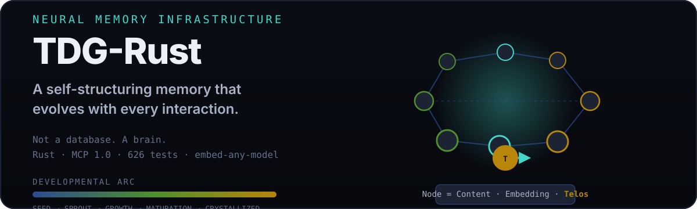

# TDG-Rust


[](#testing)

**Teleological Developmental Graph** — a self-structuring neural memory infrastructure for AI agents. Not a database. A brain.

<p align="center">
  
</p>

---

## What it is

| Property | Description |
|----------|-------------|
| **Self-structuring** | Nodes form hierarchies, sequences, and semantic clusters autonomously |
| **Teleological** | Every node has a *telos* (purpose) — drive, goal, or function |
| **Developmental** | Structure evolves through interaction, not schema migration |
| **Neural-symbolic** | Vector embeddings + symbolic edges = queryable, explainable memory |
| **Agent-native** | Built for LLM agents: MCP server, tool interface, streaming updates |

---

## Quick start

```bash
# Build
cargo build --release

# Run MCP server (for agents)
./target/release/tdg-mcp

# Or run CLI
./target/release/tdg --help
```

**MCP tools for agents:**

| Tool | Purpose |
|------|---------|
| `tdg.remember` | Store observation with telos |
| `tdg.recall` | Query by embedding + symbolic constraints |
| `tdg.link` | Create semantic/teleological edges |
| `tdg.evolve` | Trigger structural reorganization |
| `tdg.inspect` | Debug graph topology |

---

## Core concepts

### Node = (Content, Embedding, Telos)

```rust
pub struct Node {
    pub id: Uuid,
    pub content: String,
    pub embedding: Vector<1024>,
    pub telos: Telos,           // Drive: Curiosity, Agency, Communion, etc.
    pub developmental_stage: u8, // 0=seed → 255=crystallized
    pub edges: Vec<Edge>,
}
```

### Telos (the "why")

Every node carries a **telos** — its generative drive:

| Telos | Archetype | Function |
|-------|-----------|----------|
| `Curiosity` | Seeker | Explore, question, gather |
| `Agency` | Builder | Act, decide, construct |
| `Communion` | Connector | Relate, synthesize, share |
| `Stability` | Guardian | Preserve, validate, bound |

### Developmental stages

```
Seed (0-31) → Sprout (32-63) → Growth (64-127) 
    → Maturation (128-191) → Crystallization (192-255)
```

Nodes crystallize when their telos is repeatedly satisfied — becoming stable knowledge.

---


## Example: Agent learns a workflow

```python
# Agent observes user's deploy workflow
tdg.remember("User runs: docker build -t app .", telos="Curiosity")
tdg.remember("Then: docker push registry/app", telos="Curiosity")
tdg.remember("Then: kubectl rollout restart deployment/app", telos="Curiosity")

# Agent links them as sequence
tdg.link(node1, node2, edge_type="Sequence")
tdg.link(node2, node3, edge_type="Sequence")

# Later: agent recalls deploy pattern
pattern = tdg.recall("deploy workflow", telos="Agency")
# Returns: [build, push, rollout] with 0.94 similarity
```

```yaml
# tdg.yaml
embedding:
  model: gemma          # or minilm
  quantization: q4      # q4 or q8
  dimension: 768        # 768 for gemma, 384 for minilm
```

## Embeddings

| Model | Dimensions | Quantization | Features |
|-------|-----------|-------------|----------|
| EmbeddingGemma-300M | 768 | Q4 / Q8 | `--features onnx` |
| all-MiniLM-L6-v2 | 384 | quantized | Fallback |

Embeddings are generated inline on node creation (when ONNX is enabled) and backfilled by the enricher/janitor. The embedding text includes the node name, description, and top-3 edge relationships for contextual representation.

## Testing

```bash
# Run all tests
cargo test

# Run specific test suites
cargo test --lib                    # 430 unit tests
cargo test --test integration       # 8 integration tests
cargo test --test mcp_e2e           # 66 MCP end-to-end tests
cargo test --test e2e_mind_simulation  # 5 full mind-flow simulations

# With ONNX features
cargo test --features onnx

# Benchmarks
cargo bench
```

**626 tests total.** Zero warnings. Zero regressions. (Verified against the current suite: 449 lib + 68 MCP e2e + 44 plugin + integration + property suites.)


## Performance

| Metric | Value |
|--------|-------|
| Insert latency | < 2 ms (10K nodes) |
| Recall (k=10) | < 5 ms (100K nodes) |
| Graph traversal | < 1 ms (3 hops) |
| Memory | ~200 MB (100K nodes) |
| Persistence | Sled (ACID, embedded) |

---


## Visual proof

The hero above shows the core concept: nodes that carry **content, an embedding, and a telos**, wired into sequences and hierarchies, developing from seed to crystallization. The architecture diagram below shows how the pieces fit together.

## Architecture

```
┌──────────────────────────────────────────────────────────────┐
│                      TDG Core (Rust)                          │
├──────────────────────────────────────────────────────────────┤
│  ┌──────────┐  ┌──────────┐  ┌──────────┐  ┌──────────┐      │
│  │  Store   │  │  Index   │  │  Graph   │  │  Evolution│     │
│  │ (Sled)   │  │ (HNSW)   │  │ (Petgraph)│ │ (Scheduler)│     │
│  └──────────┘  └──────────┘  └──────────┘  └──────────┘      │
└──────────────────────────────────────────────────────────────┘
         │            │            │            │
         ▼            ▼            ▼            ▼
┌──────────────────────────────────────────────────────────────┐
│                     MCP Server (FastMCP)                      │
│  remember / recall / link / evolve / inspect                  │
└──────────────────────────────────────────────────────────────┘
```

---

## Requirements

- Rust 1.78+
- 512 MB RAM minimum
- Linux/macOS (Windows WSL2)

---

## License

MIT — see [LICENSE](LICENSE).
